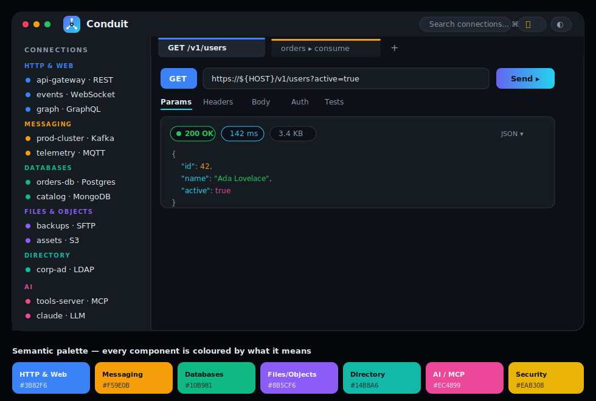

<p align="center">
  
</p>

<h1 align="center">Conduit</h1>
<p align="center"><b>One Console. Every Protocol. Zero Context Switching.</b></p>

<p align="center">
  
  
  
</p>

---

## What is Conduit?

**Conduit is a universal protocol workbench** — one native desktop app for testing, debugging,
and managing connections across the protocols and data stores of modern distributed systems:
REST, WebSocket, SSE, GraphQL, gRPC, SQL, MongoDB, Redis, Kafka, MQTT, RabbitMQ, JMS, cloud
messaging, SFTP/FTP, S3/Azure/GCS, LDAP, SNMP — plus a built-in **Model Context Protocol (MCP)
inspector** and an **AI / LLM tester**.

It unifies what would otherwise be a dozen separate tools behind **one connection tree, one
credential vault, one environment-variable system, and one searchable history** — and it reads
at a glance, because **every protocol family has its own semantic colour** (see
[`THEME.md`](./THEME.md)).

Conduit is **pure-Go, end to end**: one language, one static binary, native widgets via
[Fyne](https://fyne.io). No JVM, no bundled browser.



## Status

Conduit is under active development. The shared core is built and unit-tested; the desktop shell
and protocol views are being layered on top. See [`TASKS.md`](./TASKS.md) for the live,
phase-by-phase tracker and [`PROJECT_PLAN.md`](./PROJECT_PLAN.md) for the one-page map.

**Done so far:** the `Connector` SPI + registry, event bus, DI container, LRU cache, the
`${VAR}` environment resolver (with `.env`, defaults, nesting, escaping, secret masking), a
SQLite + FTS5 history store (search / favorites / replay), and an AES-256-GCM credential vault
(PBKDF2, 200k iters) — all with passing tests.

## Feature map (target)

| Area | Protocols / capabilities |
|------|--------------------------|
| **HTTP & Web** | REST (all methods, auth, viewers, code-gen), WebSocket, SSE, GraphQL, gRPC |
| **Messaging** | Kafka, MQTT, RabbitMQ, JMS, AWS SQS/SNS |
| **Databases** | SQL (Postgres/MySQL/MariaDB/SQLite), MongoDB, Redis |
| **Files & Objects** | SFTP, FTP/FTPS, S3, Azure Blob, GCS |
| **Directory & Monitoring** | LDAP / Active Directory, SNMP |
| **AI** | MCP inspector, LLM tester, MCP tool-calling agent |
| **Cross-cutting** | Credential vault, certificate manager, environment variables, history, F1 help, metrics |

## Requirements

- **Go 1.26+**
- A graphical display (X11/Wayland/macOS/Windows) — Conduit is a desktop GUI
- A C toolchain + system OpenGL/X11 dev headers (Linux). On Debian/Ubuntu:
  `sudo apt-get install -y gcc libgl1-mesa-dev xorg-dev`

See **[`RUN.md`](./RUN.md)** for the full per-OS prerequisite list and troubleshooting.

## Quick start

```bash
git clone https://github.com/geekpratyush/conduit.git
cd conduit
go test ./internal/...        # run the unit suite
go run ./cmd/conduit          # launch the workbench (once the shell lands)
```

## Project documents

| File | Purpose |
|------|---------|
| `README.md` | This file — overview, quick start, contact |
| `RUN.md` | Build/run instructions + **per-OS prerequisites** to install |
| `PROJECT_PLAN.md` | One-page map: what/how/where-it-stands |
| `TASKS.md` | **Living** phase-by-phase build tracker |
| `THEME.md` | Visual identity — logo, semantic palette, component treatment |

## About / Contact

Conduit is designed, built, and maintained by **Pratyush Ranjan Mishra**.

| | |
|---|---|
| 👤 **Author** | Pratyush Ranjan Mishra |
| 💼 **LinkedIn** | https://www.linkedin.com/in/leadtherightway/ |
| 🐙 **GitHub / Repository** | https://github.com/geekpratyush/conduit |

Questions, ideas, or feedback are welcome — open an issue on the repository or reach out on
LinkedIn.

## License

Proprietary — all rights reserved © Pratyush Ranjan Mishra.
